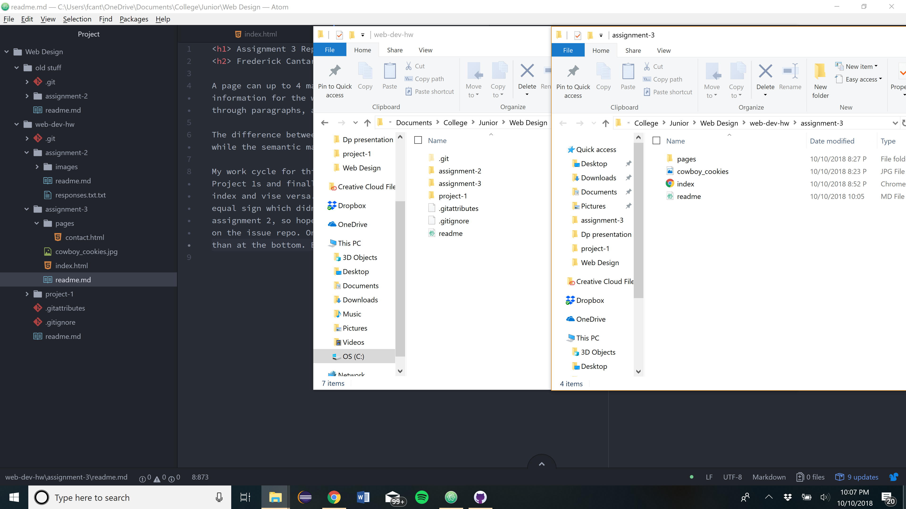

<h1> Assignment 3 Repo </h1>
<h2> Frederick Cantarine </h2>

A page can up to 4 main head elements and 6 main body elements. These elements are different because the main head elements help provide information for the whole page such as a style or title or meta data...etc., while the body elements provide the substance of the page through paragraphs, addresses and hyperlinks and such.

The difference between structural and semantic markup is that structural markup embeds the information abou the structure of a document while the semantic markup is used to reinforce the meaning of the information of the document.

My work cycle for this assignment was going through the class webpage material, finishing my assesments of the two assigned classmates' Project 1s and finally finishing assignment 3. The only problem I encountered while doing assignemnt three was linking my contact to the index and vise versa. Part of the problem was that I copied and pasted the example code from the class website and it was missing an equal sign which didn't allow the link to work. But I eventually got both links to work. I still haven't gotten around to finishing assignment 2, so hopefully I will have time in the next few days. Things have been just really busy. I did not post or check any issues on the issue repo. Only thing if I had time to ask about would be how to allign a picture I placed on the right side of the screen rather than at the bottom. But I'll probably figure that out later.

