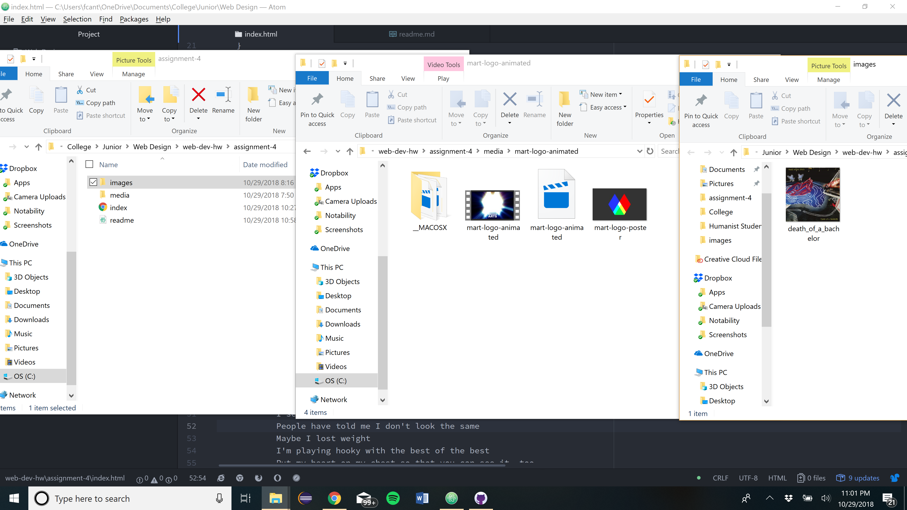

<h1> Assignment 4 Repo </h1>
<h2> Frederick Cantarine </h2>

Briefly describe the difference between divs, classes, ids, and spans.

 - Ids are unique identifiers to a specific element within the html doc.

- The class attribute is an identifier that groups similiar types of elements together by using the same name value.

- Spans identify/group content together that requires organization.

- Divs allows developers to group other elemets together in their html doc.

What is "alt text," and why do we use it?

- Alt text is alternative text that describes an image to users who cannot see the image for some reason. This way they have an idea of what should have appeared.

<h3>Work Summary</h3>
This work cycle I read through the material on the class website and then moved onto assignment 4. Only problem I have with the assignment is that I can't get the youtube video to work. I followed the instructions on how to embed it properly but I can't figure out why it won't play. It looks like it's ready to play but when you click on the play button it just says that it's unavailable. Not sure why. Besides that everything else was fine.
As far as assignment 2 is concerned, I'm not sure if I'm ever going to get around to it. Partically because I'm not sure if I will get any credit for it since it's been a long time since it was assigned.

