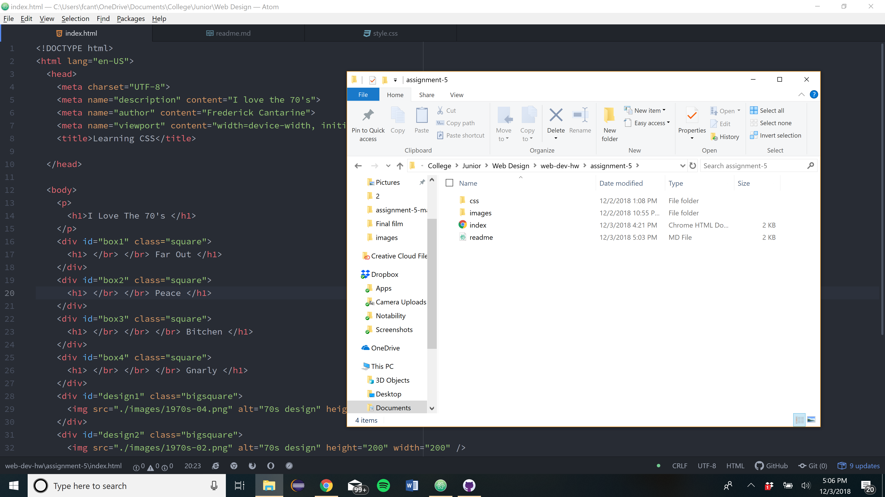

<h1> Assignment 5 Repo </h1>
<h2> Frederick Cantarine </h2>

<h3> Desgin </h3>
I went ahead and did my desgin on the 70s. I chose to do a symmetrical type desgin to reflect the time period. I have the graphic that looks like a raindbow was painted on the floor and up the wall as the center piece. I also have two flowers on the sides to further the symmetry. I took the 5 colors of the rainbow graphic into mind when I did my four boxes and text colors. Each box has a word that was popular slang for that time period.

For the colors I used the five colors of the rainbow graphic I used. It included red, orange, yellow, green and blue. Each one kindof dull and muted and not very vibrant. I also used brown as the background color because it compliments the other colors very much.

Brown #705600 (112, 86, 0)  
Red #BE4613 (190, 70, 19)  
Organge #E69408 (	230, 148, 8)  
Yellow #F4C118 (244, 193, 24)  
Green #8AA216 (138, 162, 22)  
Blue #47A4A7 (71, 164, 167)

<h3> Work Cycle </h3>
For this work cycle I read the corse material and started on the assignment. At first I wasn't inclined to do any particular time period. I ended up chosing the 70s because I like the color pallet of the graphic design that I chose. I thought it appropriate to do a symmetrical type design because alot of 70s art had a lot of symmetry. I didn't really have any problems with this assignment besides getting the graphic to move to where I wanted it. I eventually got it to go where I wanted in the full screen, but it shifts when I condense the screen, and I don't know how to fix that. I didn't post anything on the repo because I've been so buys with other classes and finals coming up.

