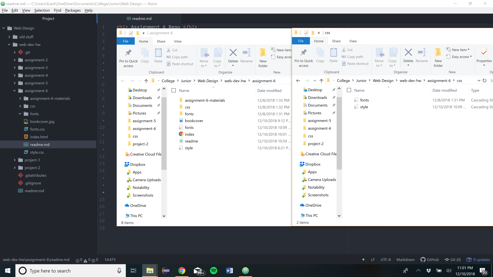

<h1> Assignment 6 Repo </h1>
<h2> Frederick Cantarine </h2>

<h3> Design </h3>
Part of my design was going with cool colors for the background. In the Shining, the movie, there was a a lot of snow, so I chose to go with cool colors. The button, however, I chose to go with red because it stands out so people know that there is a link to follow. For the font, I chose to go with a Vollkorn, serif because the text is easy to read and look clean. I chose to use white font because the white reminds me of snow, which was in the first movie.

<h3> System font </h3>
System fonts are those already installed on your local device and system. These are available to you and most programs you use, but are not necessarily to the web (usually due to licensing).
Web fonts are custom fonts hosted on a server. They do not have to be available on the user's device to appear, but require certain elements to get called up correctly.
Fonts that developers can count on being available by the system are known as "web-safe" fonts. These include font families that both Windows and Mac should have (see the graphic above).
Fallback fonts are important because if the font you have isn't supported, then you have a similar font that your program will go to, rather than some font that wouldn't look good for your program.

<h3> Work cycle </h3>
My work cycle for this assignment was reading the course material and then working on the assignment. I had a problem with not getting my style.css file working with my index. So I emailed Justine and had her help on why it wasn't work. I did what she recommended and it worked. I got most of the assignment done but the one problem I did encounter was getting the psuedo elemets to work. I didn't have time to fix it so I have it coded but it doesn't work on my live link.

