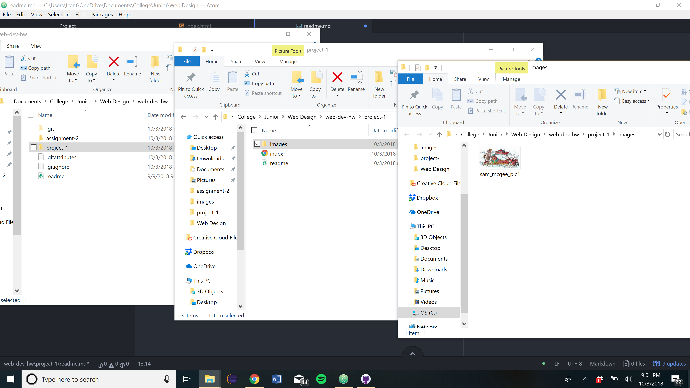

# Project 1 Repo
## Frederick Cantarine

Browsers I use:
- Google Chrome

A browser is a software program that is used to access the internet from any device. Browsers translate web languages like HTML, CSS and JavaScrpt into layouts and webpages designed by the coder.

When I used the Wayback Machine I checked out google.com. I went back to November 11th, 1998. It only have three lines of text. The first line was Welcome to Google. The second line was a link to the google seach bar. The third link was also to a google seach bar but it said Google Beta at the top. The Google word back then was still colorful but this time looks very old because the animation reflects the animation of the times which was not that great. Both links had additional links to standford seach and linux search. Compared to the 1998 version of google, today's page looks very modern with the same typical color scheme and search bar. What this new version has that the old ones didnt is the "I'm feeling lucky" button. It also has a lot less text on the page which makes it look a lot cleaner and easier to use.

The work I did for this cycle was pretty much just Project 1. I went through the course website and watched the videos that were on it. I checked out the Wayback Machine and spent some time checking out the changes between Google and Youtube's early days and their current versions. My biggest obstacle for this cycle was getting my github application to push my work onto github. Luckily, Justine was able to help fix things and now I can push my work onto github. I'm still a little behind in my work. I still need to finish assignment 2 and hope to have it done this weekend. I did not post any probelms to the repo because my only problem was technical support and not the work itself.

Not quite sure what "Embed a screenshot of your workspace at some point during your development cycle." means but I hope I've included what you want.
