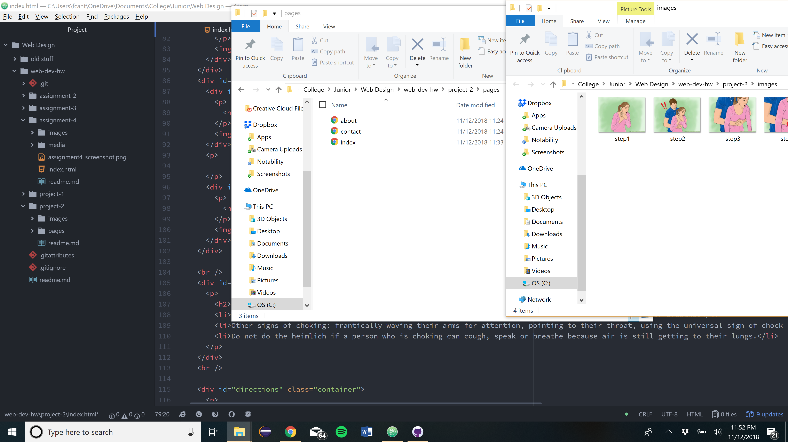

<h1> Project 2 Repo </h1>
<h2> Frederick Cantarine </h2>

<h3>Recaping My Experience</h3>
Well I've worked with java before but never html. So all of this was new. I'm not going to lie. I didn't enjoy it.
I'm not a fan of coding and this was just annoying having to go back and forth from my code to loading the new changes I've
made to the doc to see if the format is how I want it. I do appreciate learning this new material so I have a genral knowledge
of what it's like to code html. I think the div's were pretty interesting. Like subdiving your page into sections and styling them
each on their own if you wish.

<h3>CSS</h3>
I'm not anxious or excited about anything in particular for CSS. I just hope it won't be too difficult.

<h3>Work Summary</h3>
This work cycle I went through the course material online and immediatley went to starting my project. The hardest part, in my opinion, was choosing a topic to talk about. The link you refered us to had a lot of dyi's and that's great and all but not something I really
wanted to talk about. So instead I talked about the heimlich maneuver. I like this topic because I think it's an important technique that all people should know and it's easy to explain. Another hard part for this assignment was getting the formatting for the div's just right. I still didn't get them exactly how I wanted them but I think my page looks pretty good. I wanted each picture originally to just float on either side of the div's that talk about the technique, but I coudn't figure out how to without each picture stacking next to eachother, overlapping with the center div's. Eventually, I decided to move the information div's to the left side of the page and keep all the pictures on the right side. I think what I have right now is pretty good.

