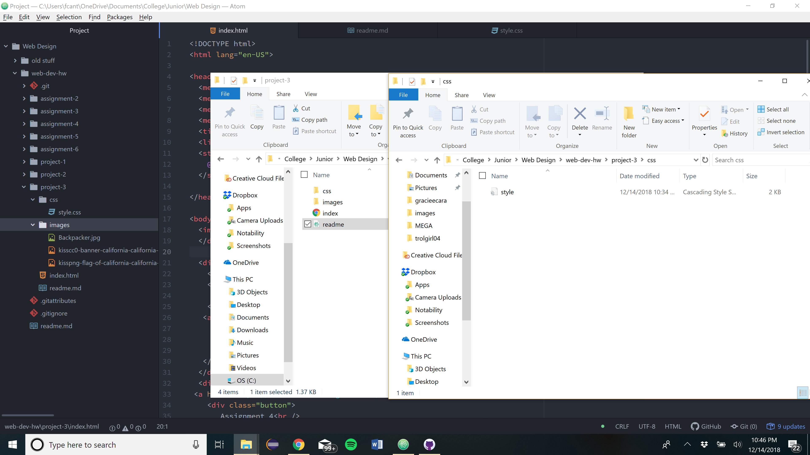

<h1> Project 3 Repo </h1>
<h2> Frederick Cantarine </h2>

<h3> Questions </h3>

 What is the difference between padding, margin, and borders?
 Padding mount of space between the inner content of the element and the element itsel. The margin is the space between the box/element and other elements, or the edge of the parent element. Borders create an exterior of the element which can be styled with color, thickness and shape. Padding works inside the element while the margin works between the height and width of the screen and the elements. Borders are on the outside of the elements.

 What was the hardest task for you to accomplish this assignment? For example, was it overlapping elements, working with sizing, creating layout, or something else entirely?

 The hardest task for me on this assignment was getting my pictures to float. I don't know what the problem was but they just didn't want to float or move around. I was going to include a second image on the right side of the screen to fill up space but I couldn't get it to float so I took it out.

 <h3> Work Cycle </h3>
 For this work cycle I read the corse content and started on project 3. I feel like my finished project is a bit simple but I think it has all the elements that are required. I didn't post any problems because I'm doing this pretty late and don't have time to wait for a response.

